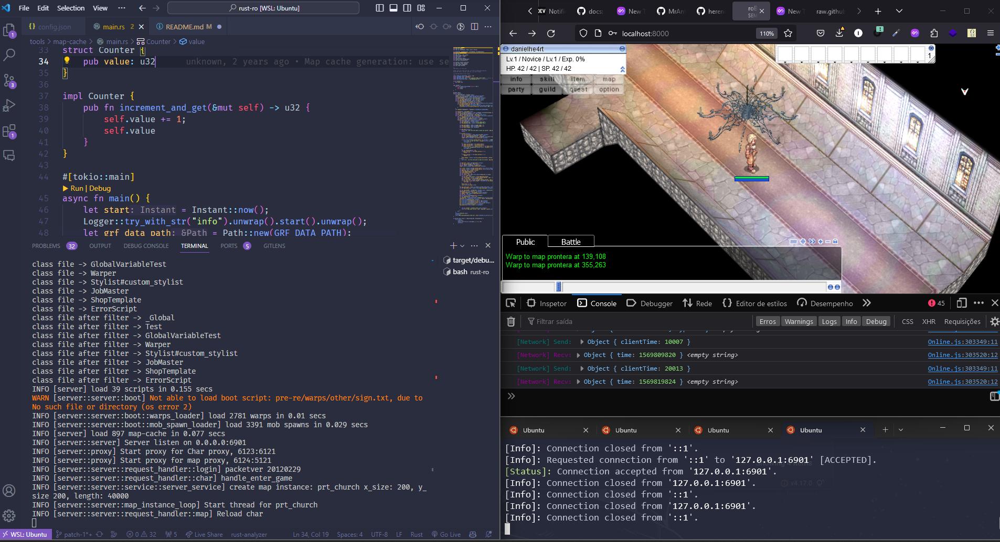
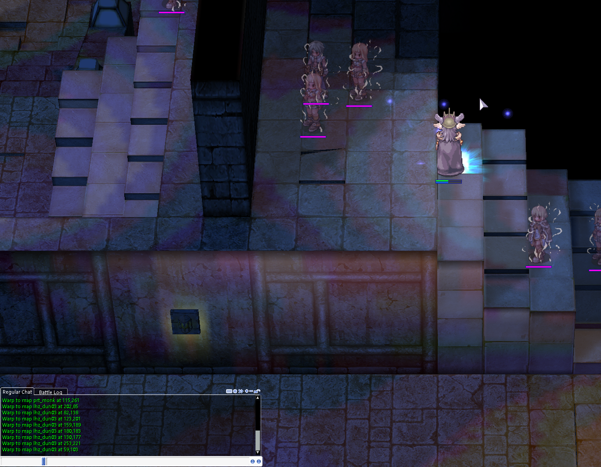
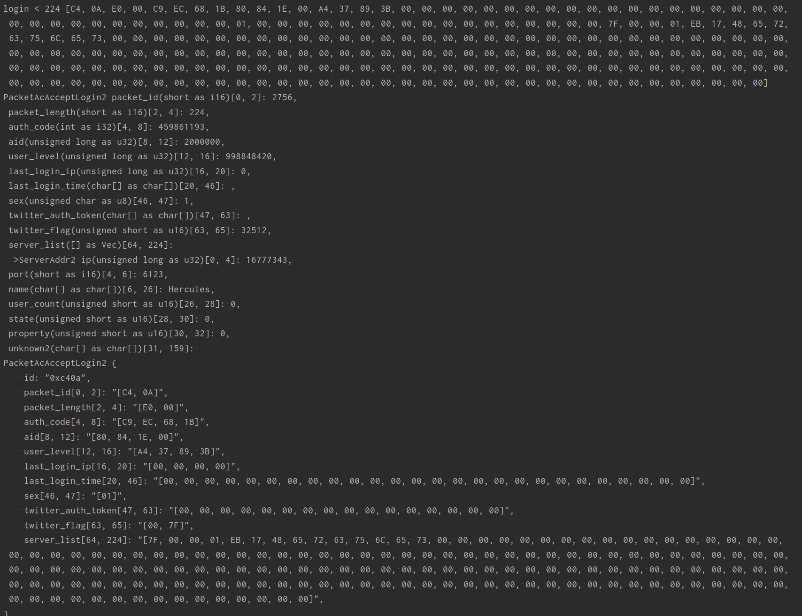

# Welcome to rust-ro!
**rust-ro** is a Ragnarok MMO Server implementation written in Rust. 

While it is a from scratch implemention it is heavily inspired by [herculesWS](https://github.com/HerculesWS/Hercules) and [rathena](https://github.com/rathena/rathena), for example this implementation support same scripting language for NPC meaning that existing scripts should work on this implementation and use the same database structure than rathena and some naming convention were kept.

**Table of Content**

- [Welcome to rust-ro!](#welcome-to-rust-ro)
  - [1. Ambition](#1-ambition)
  - [2. About Packet Version](#2-about-packet-version)
  - [3. Currently Working](#3-currently-working)
  - [4. Implementation details](#4-implementation-details)
    - [4.1 Project files structure](#41-project-files-structure)
  - [5. Setup](#5-setup)
    - [5.1 Config](#51-config)
    - [5.2 Setup DB](#52-setup-db)
      - [5.2.1 Setup DB: Docker](#521-setup-db-docker)
      - [5.2.2 Setup DB: Locally](#522-setup-db-locally)
    - [5.3 Building the Binaries](#53-building-the-binaries)
    - [5.4 Running the Server](#54-running-the-server)
      - [5.5 Running the Game](#55-running-the-game)
  - [6. Developer Notes](#6-developer-notes)
  - [7. Progress Showcase (Compilation)](#7-progress-showcase-compilation)
    - [7.1 Integration of the VM (showing instance and class(npc) variable)](#71-integration-of-the-vm-showing-instance-and-classnpc-variable)
    - [7.2 Visual debugger](#72-visual-debugger)
    - [7.3 Warps](#73-warps)
    - [7.4 Mobs](#74-mobs)
    - [7.5 Proxied packets](#75-proxied-packets)
  - [8. What has been done? ✔️](#8-what-has-been-done-️)
    - [8.1 Tools](#81-tools)
    - [8.2 Server](#82-server)
  - [9. Contribution](#9-contribution)


## 1. Ambition
The project started on August 2021 with the ambition to being able to connect on the server and navigate across maps to see monsters.

Today February 2023 a lot of features have been added, see below. My ultimate goal would be to have a fully playable implementation for **PRE-RE**, supporting packet version **20120307**.

I am working on this project for fun and also to provide a more accessible way than existing implementation to understand how Ragnarok game works for educational purpose. Each feature is covered with tests to provide internal documentation.

## 2. About Packet Version
The packet [parser, builder and serializer](https://github.com/nmeylan/rust-ro/tree/master/lib/packets/src) are all taking packet version as parameter. The [packet db](https://github.com/nmeylan/rust-ro/blob/master/tools/packets/packets_db) also support condition around packet [attributes](https://github.com/nmeylan/rust-ro/blob/master/tools/packets/packets_db#L112) and [packet id](https://github.com/nmeylan/rust-ro/blob/master/tools/packets/packets_db#L423)

Although I mentioned above wanting to fully support packet version **20120307**, this implementation can support any packet version, it is just I am testing exclusively with a [robrowser client](https://github.com/MrAntares/roBrowserLegacy) using this packet version and thus i am implementing only packet in this version.

## 3. Currently Working
Focus is now on [Skills](https://github.com/nmeylan/rust-ro/issues/11)

Also see [Meta issue](https://github.com/nmeylan/rust-ro/issues/19)


## 4. Implementation details

To understand what is going on at this project, check the [architectures notes](doc/Architecture.md).

### 4.1 Project files structure
- `lib`: contains either, `proc-macro`, `reusable structure`, `generated code`
  - `lib/packets`: Structure for packets generated by `tools/packets` from `tools/packets_db` file
  - `lib/models`: Plain old data structure to be reused in multiple modules
  - `lib/configuration`: Structure for configuration with serde deserializer implementation
  - `lib/skills`: Generated structures for skills from `configuration` and also manually implemented skills methods
- `server`: server core
  - `server/proxy`: A proxy implementation to be use between a client and an emulator (rathena or hercules) in order to capture packets
  - `server/repository`: data access layer of the server, any access to dabase is written from this layer
  - `server/server`: global event loop, map instance event loop, persistence event loop
  - `server/server/boot`: any method require in order to boostrap server state (script loader, maploader, mob spawn...)
  - `server/server/model`: Plain old non-reusable data structure (queue, cells, etc..)
  - `server/server/request_handler`: controller layer, any packet receive from client pass to a controller first
  - `server/server/script`: interface between server and script virtual machine, provides hook implementation of the virtual machine
  - `server/server/service`: any logic of the game is implemented in this layer
  - `server/server/state`: Data structure containing game state (character session, character state, mob state)
  -  `server/util`: Any utility methods
- `tools`: code generator
  - `tools/map-cache`: generate map cache from map files
  - `tools/packets`: generate packets structure from database file
  - `tools/skills`: generate skills structure from configuration file 
  - `tools/stat-calc`: A javascript/html stat calculator, cleaned up to better understand stats and combat calculation. Also added feature to generate test fixtures, to validate our implementation  


## 5. Setup 

Here's a list of **pre-requisites** to run rust-ro:

* Docker OR PostgreSQL 12+ directly on your machine 
* Rust - nighly build

### 5.1 Config

First, make a copy from `config.template.json` to `config.json`:

```shell
cd rust-ro
cp config.template.json config.json
```
Inside this JSON, you will find **database related variables** and **game related variables** (exp_rate, drop_rate etc) as well. You can change in the way you want, but for now let's leave it with default values.

```json
// config.json
[
  "game": {
    "default_char_speed": 150,
    "drop_rate": 1.0,
    "drop_rate_card": 1.0,
    "drop_rate_mvp": 1.0,
    "max_base_level": 99,
    "max_inventory": 100,
    "mob_density": 1.0,
    "max_stat_level": 99,
    "base_exp_rate": 1.0,
    "job_exp_rate": 1.0,
    "mob_dropped_item_locked_to_owner_duration_in_secs": 30,
    "player_dropped_item_locked_to_owner_duration_in_secs": 60
  }
]
```

> TODO: make a small info for each variable, maybe a wiki?

### 5.2 Setup DB

The entire database structure was based on **rAthena** but instead of using MySQL, we decided to go with PostgreSQL. There's minor modifications so far but until we mapped some **constraints**. 

Since there's features like `ON CONFLICT (column) .. DO UPDATE`, `UNNEST(array)` that is not provided by MySQL, PostgreSQL took place to leverage the project in the database aspect.

#### 5.2.1 Setup DB: Docker

If you already have **Docker** installed in your machine, we prepared a **docker-compose.yml** with all configs ready for your ragnarok server.

Go to */docker* and run:
```shell
docker-compose up -d
```

The first time, along with postgresql `initdb` is run, our custom script `init.sh` will be execute, it will create `ragnarok` database and create `ragnarok` user using `postgres` user. Then it will create ragnarok table using `ragnarok` user.

It comes with a default player account with following credentials: `admin/qwertz`

#### 5.2.2 Setup DB: Locally

If you have PostgreSQL installed in your machine, you will need to log-in into PSQL and create the user, dabase and give the necessary privilege for it:

```shell
sudo -u postgres psql
```

Run the queries below: 

```sql 
CREATE USER ragnarok WITH PASSWORD 'ragnarok';
CREATE DATABASE ragnarok;
GRANT ALL PRIVILEGES ON DATABASE ragnarok TO ragnarok;
ALTER DATABASE ragnarok OWNER TO ragnarok;
```

After that, exit pgsql and import our `/rust-ro/db/pg.sql` via cli with:

```shell
 sudo -u postgres psql -U ragnarok ragnarok < db/pg.sql
```

> If you're using the local version, don't forget to change the `database.port` number to `5433` in your `config.json` file. 


### 5.3 Building the Binaries

So far, we have a few executables being compiled together with the project:

- **maps:** TODO description
- **maps-tool:** TODO description
- **packets:** TODO description
- **packets-tool:** TODO description
- **server:** TODO description
- **skills-enum-generator:** TODO description

To build, just go on the project root and run: 

```shell
cargo build
```

Simple like that! Now you're good to run your servers. 

### 5.4 Running the Server

After we have everyting set-up (binaries and database), we should run server binary to turn on **rust-ro**.

To run the `server` binary, you will need a `ENV` variable called `DATABASE_PASSWORD` together with your command:

```shell
DATABASE_PASSWORD=ragnarok cargo run --bin=server
```

If everything goes right, you should receive something like this output:

```
INFO [server] load 39 scripts in 0.126 secs
INFO [server::server::boot::warps_loader] load 2781 warps in 0.007 secs
INFO [server::server::boot::mob_spawn_loader] load 3391 mob spawns in 0.022 secs
INFO [server] load 897 map-cache in 0.05 secs
INFO [server::proxy] Start proxy for Char proxy, 6123:6121
INFO [server::proxy] Start proxy for map proxy, 6124:5121
INFO [server::server] Server listen on 0.0.0.0:6901
```

#### 5.5 Running the Game


The goal of the project is to run all packages from **packetver 20120307**, we decided to use [roBrowserLegacy](https://github.com/MrAntares/roBrowserLegacy). 

If you have interest to contribute in a client with packetver 20120307, open a new issue and let's make it happen!

## 6. Developer Notes

Since were using **rAthena** and **Hercules** sources for this project, we decided to add a new layer of proxy by publishing the same package send by the client to `rust-ro` and a second emulator.

- All packets for account 2000000 are handle by this project.
  - You can also go to config.json and add more account_ids into the rust-ro server. 
- All packets for any other account are proxied (and display in console) to hercules or rathena.
- clientinfo.xml to be changed to target port 6901

In proxy mode:
- login, char, map server to be running using default ports (6900, 6121, 6122)


## 7. Progress Showcase (Compilation)
A compilation of progress made so far, **click on streamable video below**

[](https://streamable.com/jiapub "Compilation of features so far")

[](https://streamable.com/ofni1d "Compilation of features so far")

### 7.1 Integration of the VM (showing instance and class(npc) variable)

https://user-images.githubusercontent.com/1909074/178155321-d3eeb4b8-32ed-4901-bbfe-b101b1a5a56d.mp4

### 7.2 Visual debugger

Debug server state with a UI

### 7.3 Warps



### 7.4 Mobs


### 7.5 Proxied packets



## 8. What has been done? ✔️

Some list of features that was developed so far: 

### 8.1 Tools
- packet structure generator from [packet db](https://github.com/nmeylan/rust-ro/blob/master/tools/packets/packets_db)
- packet parser generator
- map cache generator
### 8.2 Server
- proxy login, char and map request to hercules/rathena login, char and map servers
- packet debug
- login
- char server features(create char, delete char, join game)
- move character in a loaded map, synchronized with client side movement (no lag, or teleportation, movement is smooth)
- character position calculation (implementation of client side path finding)
- debug log in in-game chat 
- parse scripts (only warps and mobs at the moment)
- warp (change map, reset states)
- display scripts client side (only warps and mobs at the moment)
- visual debugger
- map instances (map are lazily loaded, an instance is created when a player join an non initialized map)
- mob spawn
- atcommand: @go, @warp
- mob move
- NPC scripts (partially: see https://github.com/nmeylan/rust-ro/issues/3) via [rathena script lang interpreter](https://github.com/nmeylan/rathena-script-lang-interpreter)
- basis for inventory management
- basis for skills
- basis for consumable item usage
- basis for player attacking mob
- mob drops item on death

## 9. Contribution
This project is currently _half-open*_ to contribution. The reason is that all basis have not been put in place already and there are many thing to design yet.

However if you are motivated and want to contribute you can take a look to the [contribution guide](https://github.com/nmeylan/rust-ro/blob/master/Contributing.md)

_* contribution can be made under certain condition_
