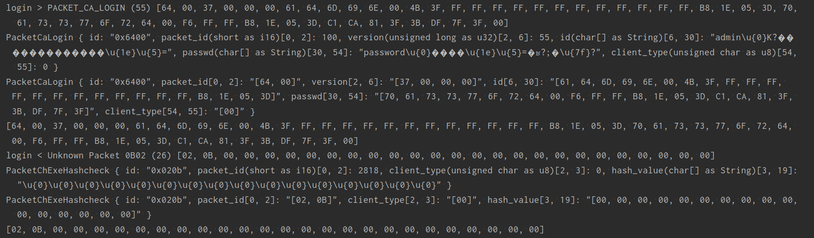

# rust-ro-hercules

An attempt to learn rust while toying with [herculesWS](https://github.com/HerculesWS/Hercules)

The goal is to rewrite some part of hercules on rust while forwarding client request to actual hercules if feature are not implemented in this project.

# What has been done?
- proxy login, char and map request to hercules login, char and map servers
- packet structure generator
- packet parser
- packet debug




# Dev
- install mysql server to get `mysqlclient.lib` in order to make diesel to work
- install diesel cli `cargo install diesel_cli --no-default-features --features mysql`
- run `diesel migration up`

Note for windows: define `MYSQLCLIENT_LIB_DIR` env, with value:
```
$ echo $MYSQLCLIENT_LIB_DIR
C:\Program Files\MySQL\MySQL Server 8.0\lib
```