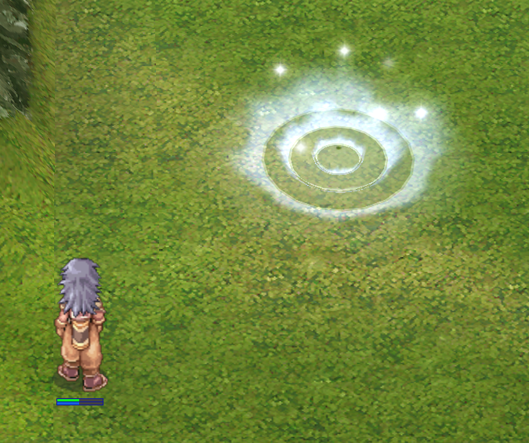
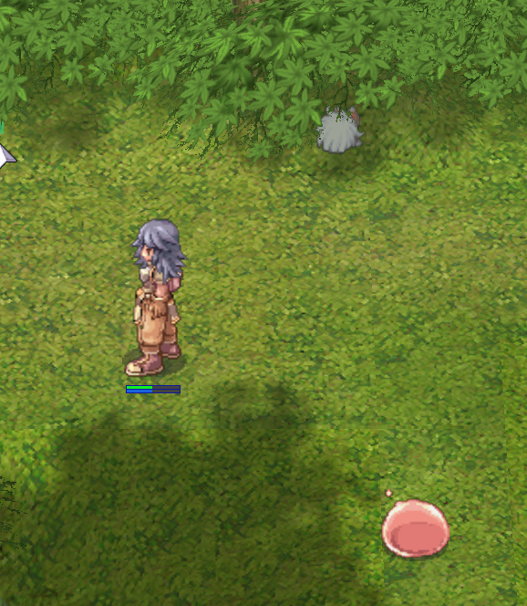

# rust-ro
Ragnarok mmo server reimplementation for fun. Inspired by [herculesWS](https://github.com/HerculesWS/Hercules) and [rathena](https://github.com/rathena/rathena)

# Pre-requisite
- mysql
- RO db (loaded via hercules or rathena scripts)

# Usage
- All packets for account 2000000 are handle by this project.
- All packets for any other account are proxied (and display in console) to hercules or rathena.

- clientinfo.xml to be changed to target port 6901

In proxy mode:
- login, char, map server to be running using default ports (6900, 6121, 6122)

# What has been done? ✔️
## Tools
- packet structure generator from [packet db](https://github.com/nmeylan/rust-ro/blob/master/tools/packets/packets_db)
- packet parser generator
- map cache generator
## Server
- proxy login, char and map request to hercules login, char and map servers
- packet debug
- login
- char server features(create char, delete char, join game)
- move character in a loaded map, synchronized with client side movement (no lag, or teleportation, movement is smooth)
- character position calculation (implementation of client side path finding)
- debug log in in-game chat 
- parse scripts (only warps and mobs at the moment)
- warp (change map, reset states)
- display scripts client side (only warps and mobs at the moment)
- visual debugger
- map instances (map are lazily loaded, an instance is created when a player join an non initialized map)
- mob spawn
- atcommand: @go, @warp
- mob move

# NPC/Script (wip) 👷
- VM is implemented here https://github.com/nmeylan/rathena-script-lang-interpreter

Integration of the VM

# Currently working on 👷
- Npc script https://github.com/nmeylan/rathena-script-lang-interpreter
# TODO
in random order, features are implemented based on my current mood.
- script
- player attack mob
- mob attack player
- equipment
- class
- drop
- exp

## Visual debugger

Debug server state with a UI

## warp

## mob

## Proxied packets

## In game debug

