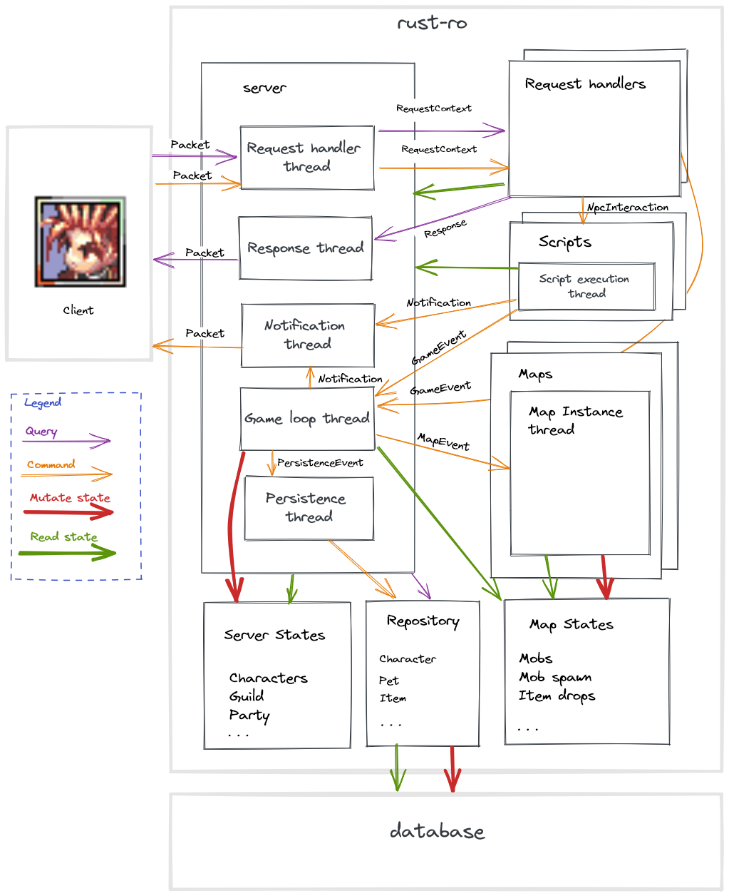

# Architecture

Client expect to interact with 3 different server:
- Login: to handle everything related to user authentication
- Char: to handle everything related to characters selection, but also party, guild and pet
- Map: to handle the rest of the game logic. It is the core of the server.

This split seems not really relevant, scaling can be achieved in a different way.

This server implement all 3 servers above in one. This will simplify implementation: no inter server communication.

# Diagram

Diagram below shows how:
- Read requests are handled
- Command requests are handled
- States are accessed
- States are mutated
- States are read from database
- States are persisted in database

