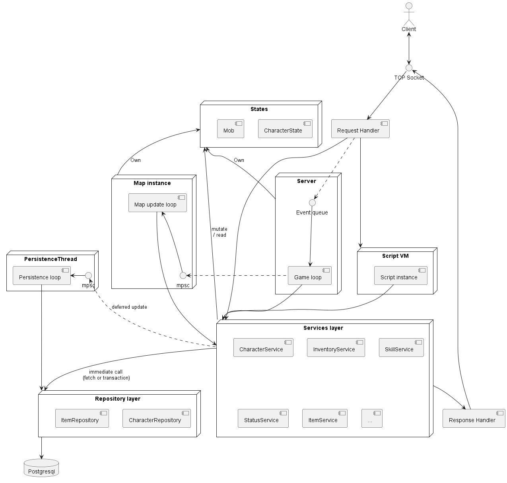
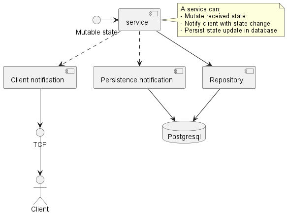

# Architecture

Client expect to interact with 3 different server:
- Login: to handle everything related to user authentication
- Char: to handle everything related to characters selection, but also party, guild and pet
- Map: to handle the rest of the game logic. It is the core of the server.

This split seems not really relevant, scaling can be achieved in a different way.

This server implement all 3 servers above in one. This will simplify implementation: no inter server communication.

## Pinciples
We distinguish 2 types of client request:
- **Query**: request which read state of the server (ie: get mob name)
- **Command**: request which mutate state of the server (ie: char move)

In this implementation we can split states in 2 parts:
- **Server**: own states of player session, character 
- **Maps**: Each map instance own states of mob, drop, any item related to a map instance

This implementation relies heavily on message passing.

## Message passing
**Instead of sharing memory** and use **lock** to update state across different thread, we rely on message passing, where messages ( we call them events) describe a change to apply.

This allow us to keep mutability ownership in a single place and avoid to use lock (and end with deadlock or complicated code) and inconsistent state

## Components

### Game loop thread
Server implement a game loop. The game loop refresh server states at a fixed rate (ie: 40ms). 

To refresh states, we queue events for the next tick or for the nth coming tick.

At each iteration, queued events will be dequeued and apply game state update.
This is the only way we have to update a game state.

In addition, some updates require we:
- Persist the change in database
- Notify clients of the change

For example when a player change his cloth color, the color has to be saved in database and player client and other players clients need to be notify of the color change.

Game loop will emit `PersistenceEvent` and `ClientNotification` which will be consumed by persistence thread and client notification thread

### Persistence thread
This thread is responsible to perform **write** query in database

### Client notification thread
This thread is responsible to send state change packet to clients

## Service layer
